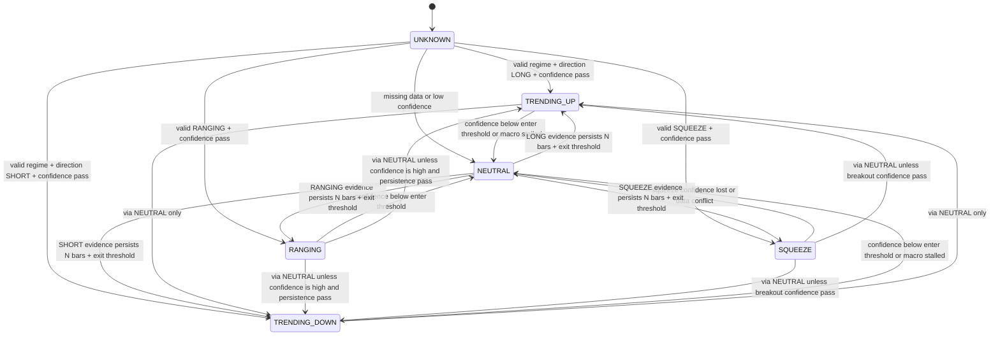

# R1 Regime Arbiter Contract Spec

- Date: 2026-04-12
- Scope: `feat/btc-atr-grid`
- Status: spec only. Do not implement runtime code from this document.
- Parent: `plans/2026-04-12_regime_arbiter_design.md`
- Inputs: R0 reports, D1 top-3 SQUEEZE review, Ruei decisions D2/D3.

## Hard Guardrails

1. V54 strategy logic is frozen. R1 can guard V54 at the arbiter/router layer, but must not edit `trader/strategies/v54_noscale/`.
2. RegimeEngine is diagnose-first. R1 must not tune `trader/regime.py` thresholds, confirm counts, or SQUEEZE conditions.
3. Position Handover is out of scope. Existing positions stay managed by their entry strategy.
4. Confidence is scalar in R1: `confidence: float` means confidence in the current arbiter label.
5. `SQUEEZE` is first-class in the R1 state machine, but has `NEUTRAL` behavior: freeze new entries; no strategy is assigned to trade it.

## R1 Decisions Consumed

| decision | value | source |
|---|---|---|
| D1 SQUEEZE treatment | first-class state, `NEUTRAL` behavior | `reports/squeeze_chart_review_top3.md` |
| D2 confidence shape | scalar `confidence in [0, 1]` | Ruei decision |
| D3 hysteresis mitigation | arbiter confidence gate, do not modify RegimeEngine | Ruei decision |

## State Set

| state | meaning | entry behavior in R1 |
|---|---|---|
| `TRENDING_UP` | Regime is trending and direction is LONG | V54 may enter if confidence and macro overlay pass. |
| `TRENDING_DOWN` | Regime is trending and direction is SHORT | V54 may enter if confidence and macro overlay pass. |
| `RANGING` | Regime is ranging | V54 remains fallback executor until R2/R3 proves a replacement. |
| `SQUEEZE` | Compression candidate | Freeze new entries; existing positions remain self-managed. |
| `NEUTRAL` | Transition / low confidence / conflict zone | Freeze new entries; existing positions remain self-managed. |
| `UNKNOWN` | Data unavailable or invalid | Freeze new entries; existing positions remain self-managed. |

## State Machine



Rule: hard flips between directional trend states should pass through `NEUTRAL` unless R1 implementation later defines a reviewed high-confidence exception. This avoids strategy thrash during reversal/fade zones.

## Regime Snapshot

Pseudo-interface only:

```python
@dataclass(frozen=True)
class RegimeSnapshot:
    label: str                 # TRENDING_UP / TRENDING_DOWN / RANGING / SQUEEZE / NEUTRAL / UNKNOWN
    confidence: float          # scalar confidence in label, range [0, 1]
    direction: str | None      # LONG / SHORT / None
    source_regime: str | None  # raw RegimeEngine current_regime
    detected: str | None       # raw RegimeEngine last_detected_regime
    macro_state: str | None    # MACRO_BULL / MACRO_BEAR / MACRO_STALLED / UNKNOWN
    entry_allowed: bool
    reason: str
    components: dict[str, float | str | None]  # diagnostics only, not routing API in R1
```

`components` should record ADX level, ADX slope, BBW percentile, ATR%, and persistence for audit/debug, but strategies must not route directly on `components` in R1.

## Confidence Inputs

| input | R1 role | notes |
|---|---|---|
| ADX absolute level | trend/range evidence | Avoid using high ADX alone as high confidence because R0 showed Apr-May chop-trend false confidence. |
| ADX slope | trend fade evidence | Falling ADX should reduce trend confidence before RegimeEngine flips. |
| BBW percentile | compression/range evidence | Use rolling production-safe percentile, not P0.6 per-window research percentile. |
| ATR% | expansion/volatility context | Use `atr / close` so BTC price level does not distort volatility. |
| Regime persistence | anti-thrash evidence | Increase confidence only after evidence persists. |

R1 must not lock numeric weights or thresholds without Ruei review. Use `<TBD by Ruei>` in implementation tickets until values are selected.

## Strategy Contract

Pseudo-interface only:

```python
class StrategyContract:
    strategy_name: str
    priority: Literal["PRIMARY", "FALLBACK", "OFF"]

    def required_regimes(self) -> set[str]:
        ...

    def min_confidence_to_enter(self) -> float:
        ...

    def can_enter(self, snapshot: RegimeSnapshot) -> bool:
        return (
            snapshot.label in self.required_regimes()
            and snapshot.confidence >= self.min_confidence_to_enter()
            and snapshot.entry_allowed
        )

    def behavior_on_regime_change(
        self,
        old: RegimeSnapshot,
        new: RegimeSnapshot,
    ) -> Literal["exit_self_managed", "freeze_new_entries"]:
        ...
```

R1 public strategy-facing surface is `label + confidence + entry_allowed`. `components` are audit data, not a stable strategy API.

## V54 Contract

| field | R1 value |
|---|---|
| `strategy_name` | `v54_noscale` |
| `required_regimes` | `{TRENDING_UP, TRENDING_DOWN, RANGING}` |
| `priority` | `FALLBACK` for `RANGING` until R2/R3 proves replacement; `PRIMARY` for directional trend entries currently routed to V54 |
| `min_confidence_to_enter` | `<TBD by Ruei>` |
| `behavior_on_regime_change` | `exit_self_managed` |

V54 keeps `RANGING` because P0.6 V54-in-RANGING baseline was PF 2.17, n=22. R2/R3 may replace or demote V54 in RANGING only after proving a gap and beating the baseline.

## SQUEEZE Contract

R1 has no SQUEEZE strategy.

```python
if snapshot.label == "SQUEEZE":
    snapshot.entry_allowed = False
    snapshot.reason = "squeeze_freeze_new_entries"
```

Existing positions:

- do not hand over;
- do not force-close solely because of SQUEEZE;
- remain under the entry strategy's stop/lock/exit lifecycle.

## Neutral Zone Policy

R1 behavior:

- If confidence falls below `ARBITER_NEUTRAL_THRESHOLD`, arbiter state becomes `NEUTRAL`.
- In `NEUTRAL`, all strategies freeze new entries.
- Existing positions remain `exit_self_managed`.
- Exit from `NEUTRAL` requires confidence above `ARBITER_NEUTRAL_EXIT_THRESHOLD` and evidence persistence for `ARBITER_NEUTRAL_MIN_BARS`.
- `ARBITER_NEUTRAL_EXIT_THRESHOLD` should be greater than or equal to `ARBITER_NEUTRAL_THRESHOLD` to create hysteresis.

Pseudo-flow:

```python
if data_missing:
    return UNKNOWN.freeze_entries("regime_data_missing")

candidate = classify_from_regime_engine_and_features()
confidence = score_candidate(candidate)

if confidence < Config.ARBITER_NEUTRAL_THRESHOLD:
    return NEUTRAL.freeze_entries("low_regime_confidence")

if current_state == NEUTRAL:
    if confidence >= Config.ARBITER_NEUTRAL_EXIT_THRESHOLD and persisted_for_min_bars(candidate):
        return candidate.allow_entries()
    return NEUTRAL.freeze_entries("neutral_hysteresis")

return candidate.with_entry_policy()
```

## Macro Overlay Policy

Macro overlay is a safety gate above regime routing.

R1 macro states:

| macro state | meaning | behavior |
|---|---|---|
| `MACRO_BULL` | BTC weekly trend bullish | Allow LONG trend entries if local arbiter passes. |
| `MACRO_BEAR` | BTC weekly trend bearish | Allow SHORT trend entries if local arbiter passes. |
| `MACRO_STALLED` | BTC weekly trend flat/uncertain | Freeze trend-strategy new entries or apply size multiplier, depending on Ruei decision. |
| `UNKNOWN` | weekly data missing | Conservative default: freeze new trend entries. |

Open design point:

- Weekly EMA alignment vs weekly ADX is not decided in R1 draft. Keep as `<TBD by Ruei>`.
- If `MACRO_STALLED_SIZE_MULT` is used, it must be explicit in config and parity-guarded. The simpler R1-safe option is to freeze trend entries while stalled.

Lookahead guard:

- Macro overlay must use only fully closed weekly candles.
- Weekly data must be timestamped and audited so R4 transition stress tests can verify no future candle leaked into decisions.
- R4 must compare V54 alone vs Neutral Zone vs Neutral Zone + Macro Overlay before enabling macro overlay in testnet.

## Position Handling

| event | R1 behavior |
|---|---|
| state changes while position open | Do not hand over. Existing position stays managed by entry strategy. |
| state becomes `NEUTRAL` | Freeze new entries only. |
| state becomes `SQUEEZE` | Freeze new entries only. |
| macro state becomes `MACRO_STALLED` | Freeze new entries or apply reviewed size multiplier. Do not force-close existing positions in R1. |
| data becomes `UNKNOWN` | Freeze new entries. Existing positions remain self-managed. |

Force-close behavior is out of scope for R1 unless Ruei explicitly approves a separate risk rule.

## Config Exposure

R1 implementation must expose arbiter settings in both `trader/config.py` and `bot_config.json`, and extend the P0 config parity guard before runtime use.

Initial critical keys to protect:

```python
ARBITER_NEUTRAL_THRESHOLD
ARBITER_NEUTRAL_EXIT_THRESHOLD
ARBITER_NEUTRAL_MIN_BARS
MACRO_OVERLAY_ENABLED
MACRO_STALLED_SIZE_MULT
```

R1 spec does not choose numeric values.

## R4 Test Hooks To Preserve

R1 implementation should make these test slices observable:

- raw RegimeEngine state;
- arbiter label;
- scalar confidence;
- neutral entry/exit reason;
- macro state;
- `entry_allowed`;
- strategy chosen or rejected;
- persistence bar count.

These fields are needed for R4 transition stress test and for debugging Apr-May 2025 chop-trend behavior.

## Acceptance Checklist

- State machine includes `TRENDING_UP`, `TRENDING_DOWN`, `RANGING`, `SQUEEZE`, `NEUTRAL`, `UNKNOWN`.
- StrategyContract uses scalar `confidence`, not vector routing.
- V54 keeps `{TRENDING_UP, TRENDING_DOWN, RANGING}`.
- `SQUEEZE` is first-class but freezes new entries in R1.
- Neutral Zone freezes new entries and does not force-close positions.
- Macro Overlay is a spec-level gate with closed-weekly-candle lookahead guard.
- CRITICAL_KEYS list is present.
- No runtime code is changed by R1 spec work.

## Do Not Implement In R1 Spec

- Do not modify `trader/regime.py`.
- Do not modify `trader/strategies/v54_noscale/`.
- Do not implement Position Handover.
- Do not assign a strategy to `SQUEEZE`.
- Do not hardcode thresholds before Ruei chooses them.
- Do not enable macro overlay in runtime before R4 stress test.
