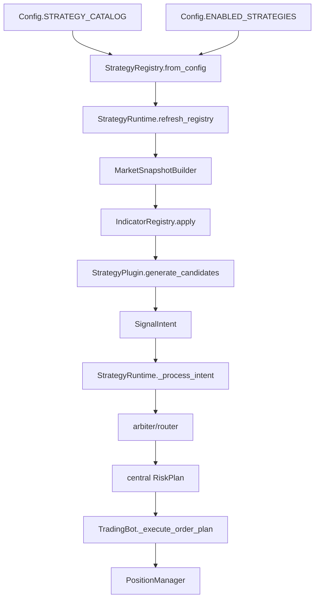

# Strategy Plugin Pipeline Review

Date: 2026-04-19

Scope: strategy-plugin cartridge pipeline review after the runtime reset and
backtest config-injection cleanup. This report does not promote any plugin and
does not change runtime defaults.

## Executive Read

Current status: the kernel is clean enough to continue, but not smooth enough
to mass-produce new strategy cartridges yet.

There are no P0 blockers in the core path:

```text
StrategyPlugin -> SignalIntent -> StrategyRuntime -> arbiter/router -> central risk -> execution handoff
```

The P1 risks are infrastructure friction and silent-failure modes:

- New plugin registration still requires editing `trader/config.py`.
- `params_schema` is not enforced.
- Unknown `required_indicators` silently produce missing columns and zero signals.
- plugin-owned position state exists, but the authoring contract is not explicit enough.
- historical backtest docs/comments still contain mojibake in integration files.
- trade outputs do not make plugin attribution easy enough for multi-plugin matrices.

Recommendation: before implementing the first research-list strategy, do a
small Phase 3 infra pass: parameter validation, indicator preflight, position
state contract documentation, backtest comment cleanup, and authoring guide.

## Cartridge Acceptance Checklist

A normal new strategy cartridge should only need these durable file changes:

- `trader/strategies/plugins/<plugin_id>.py`
- focused tests under `trader/tests/`
- one catalog/manifest entry
- optional backtest smoke test when the plugin uses a new timeframe, side, or exit pattern
- candidate review artifacts under `reports/` or `extensions/Backtesting/results/`

If a normal plugin requires changes to these files, treat it as infrastructure
debt unless Ruei explicitly approved a kernel extension:

- `trader/bot.py`
- `trader/strategy_runtime.py`
- `trader/config.py` runtime defaults
- `scanner/market_scanner.py`
- `trader/signal_scanner.py`
- `extensions/Backtesting/backtest_engine.py`
- `extensions/Backtesting/backtest_bot.py`
- `extensions/Backtesting/config_presets.py`

Current gap: because `STRATEGY_CATALOG` lives in `trader/config.py`, the
catalog/manifest entry currently violates the ideal checklist. This is not a
runtime safety bug, but it is the largest cartridge-model friction.

## Current Pipeline Trace



Backtest inserts itself around the same runtime path:

```text
BacktestConfig.enabled_strategies
  -> BacktestEngine._effective_config_overrides()
  -> _backtest_context()
  -> create_backtest_bot()
  -> StrategyRuntime
```

That boundary is materially clean: backtest uses per-run `Config` overrides and
does not require legacy lane adapters.

## Empirical Cartridge Test

Test subject: existing MACD pilot plugin, treated as if it were the first
cartridge.

Plugin id:

```text
macd_zero_line_btc_1d
```

Observed required surfaces:

- plugin implementation: `trader/strategies/plugins/macd_zero_line.py`
- focused plugin tests: `trader/tests/test_macd_zero_line_strategy.py`
- catalog entry: `trader/config.py` `Config.STRATEGY_CATALOG`
- live-like backtest smoke: `extensions/Backtesting/tests/test_strategy_runtime_backtest.py`
- candidate report helper: `extensions/Backtesting/plugin_candidate_review.py`

Commands run:

```bash
python -c "from trader.config import Config; Config.validate(); print('Config.validate OK')"
python -m pytest trader\tests\test_macd_zero_line_strategy.py extensions\Backtesting\tests\test_strategy_runtime_backtest.py::test_macd_zero_line_strategy_runs_through_live_like_backtest_path extensions\Backtesting\tests\test_report_generator.py -q
```

Result:

```text
Config.validate OK
13 passed
```

Friction log:

| step | result | friction |
|---|---|---|
| plugin file | works | contract is readable, but `params_schema` is inert |
| focused unit tests | works | no shared authoring HOWTO yet |
| catalog entry | works | requires editing `trader/config.py` |
| live-like backtest smoke | works | synthetic data test proves runtime path, not full historical matrix |
| candidate report helper | works | helper validates artifacts, but does not execute matrix |
| full matrix backtest | not run | local cache has funding parquet only; OHLCV cache is absent, so a real matrix would download data |

Interpretation: the MACD cartridge can pass through the current runtime and
backtest path. The pain is not the kernel path; the pain is plugin authoring
ergonomics, validation, data readiness, and naming drift.

## Findings

### F1 Catalog Is Not Drop-In

Severity: P1.

Evidence:

- `trader/config.py` stores `Config.STRATEGY_CATALOG`.
- `trader/strategies/base.py` loads plugins through `StrategyRegistry.from_config()`.

Impact: adding a cartridge requires touching runtime config. That is safe while
entries remain disabled, but it contradicts the target "drop in a game
cartridge" model.

Options:

- Move catalog entries to `trader/strategies/plugins/_catalog.py`.
- Add explicit plugin manifests and load them into the registry.
- Auto-discover modules later, but only if import side effects are kept tightly controlled.

Recommendation: do not auto-discover yet. Move the research catalog out of
`Config` first, then let `Config` keep only runtime toggles such as
`STRATEGY_RUNTIME_ENABLED` and `ENABLED_STRATEGIES`.

### F2 `params_schema` Is Not Validation

Severity: P1.

Evidence:

- `StrategyPlugin.params_schema` is a class attribute.
- `StrategyRegistry.from_config()` passes `params` directly into the plugin.
- No code checks unknown keys or wrong types.

Impact: typoed params can silently change strategy behavior or fail only inside
`generate_candidates()`.

Recommendation:

- Add registry-time parameter validation.
- Start minimal: reject unknown param keys; type-check known keys.
- Keep missing params allowed for now because existing plugins use code defaults.
- Add a later explicit required/optional schema shape only when needed.

### F3 Missing Indicator Can Become Silent Zero-Signal

Severity: P1.

Evidence:

- `StrategyRuntime.MarketSnapshotBuilder` calls `IndicatorRegistry.apply(df, indicators)`.
- `IndicatorRegistry.apply()` ignores unknown indicator names.
- Plugins check for columns and return `[]` if columns are missing.
- The MACD pilot already carries local guard code (`_has_entry_columns`) to avoid
  using incomplete frames, which proves plugin authors are currently patching
  around this gap one strategy at a time.

Impact: a strategy asking for an unsupported indicator can look like a legitimate
zero-trade result. That is dangerous for research triage.

Recommendation:

- Add `IndicatorRegistry.supported_indicators()`.
- Add preflight in `MarketSnapshotBuilder` or registry setup.
- Unknown required indicators should create an explicit reject/audit error or
raise during backtest setup.

For production runtime, fail-closed is preferable. For backtest, the report
should surface this as a run error rather than a normal zero-signal run.

### F4 Position Plugin State Needs Contract Wording

Severity: P1.

Evidence:

- `PositionManager` already persists `plugin_state`.
- `FixtureExitStrategy` mutates `position.plugin_state`.
- `StrategyPlugin.get_state()` / `load_state()` exist but are not connected to
per-position state.

Impact: exit plugins can use state today, but authors do not have a documented
rule for namespacing, mutation, or compatibility.

Recommendation:

- Document `position.plugin_state` in `trader/strategies/plugins/HOWTO.md`.
- Recommend namespacing by `plugin.id` for any multi-field state.
- State that plugin position state must be JSON-serializable and backward-compatible.
- Consider a small helper later, but documentation is enough before the first new plugin.

### F5 Extension Points Need Candidate-Driven Decisions

Severity: P1 for design, not immediate implementation.

Deferred points from the kernel reset:

- `route_policy`
- `fixed_notional`
- per-strategy leverage
- `external_features`

Candidate pressure:

- `external_features`: likely needed by Hash Momentum and Moon Phases.
- `fixed_notional`: likely needed by fixed-risk breakout variants.
- short-side handling: kernel supports `SHORT`, but current BTC counter-trend
  behavior can block some short candidates depending on market context.
- `route_policy` and per-strategy leverage: no clear first-pass blocker yet.

Recommendation: design extension-point shapes in Phase 3 documentation, but
implement only when the next selected candidate proves the need.

### F6 Backtest Integration Comments Are Mojibake

Severity: P1 documentation friction.

Evidence:

- `extensions/Backtesting/backtest_bot.py`
- `extensions/Backtesting/backtest_engine.py`
- `extensions/Backtesting/report_generator.py`
- `extensions/Backtesting/data_loader.py`

Impact: these are core onboarding files for cartridge backtesting. The logic can
be correct while the file is still unpleasant and risky to modify.

Recommendation: clean comments/docstrings without changing logic.

### N1 Signal-Type Naming Now Means Plugin Id

Severity: P2.

Evidence:

- `extensions/Backtesting/signal_type_filter.py` filters `intent.strategy_id`.
- `BacktestConfig.allowed_signal_types` now holds plugin ids.
- `SignalAuditCollector` summary keys still use `signal_type`.

Impact: functionally correct but semantically stale.

Recommendation:

- Rename the narrow backtest allowlist first:
  - `signal_type_filter.py` -> `plugin_id_filter.py`
  - `allowed_signal_types` -> `allowed_plugin_ids`
- Keep CSV column rename for a separate schema-aware sweep because dashboards
  and attribution tools still consume `signal_type`.

### N2 Trade CSV Lacks Plugin Trace Columns

Severity: P2, but high leverage for review.

Evidence:

- `extensions/Backtesting/report_generator.py` trade columns do not include
  `strategy_id` or `strategy_version`.
- `TradingBot._execute_order_plan()` and `PositionManager` already carry both.

Impact: multi-plugin candidate matrices require rejoining audit files to answer
"which plugin made this trade?"

Recommendation: add `strategy_id` and `strategy_version` to `trades.csv` once
the close-record path reliably carries those fields.

## Verified Clean Boundaries

### Scanner Boundary

`scanner/market_scanner.py` still has scanner-owned 2B concepts, but runtime
plugin execution does not consume those signal types. `trader/bot.py` loads
scanner results as symbols only; plugin runtime receives a symbol universe, not
scanner entry prices or legacy signal types.

Decision left to Ruei: keep scanner ranking as a 2B-biased candidate funnel, or
later build a strategy-agnostic scanner universe. This is not a current kernel
blocker.

### Backtest Bot

`create_backtest_bot(...)` is plugin-agnostic. It accepts per-run config
overrides and a backtest-only allowlist. It does not hardcode MACD, V54, 2B,
EMA, or VB.

Caveat: it unconditionally forces safe backtest defaults such as scanner off,
Telegram off, mocked balance, and `DRY_RUN=False` to exercise local execution
paths. This should be documented in the HOWTO.

### Catalog Entry Shape

Current entries share:

```text
{enabled, module, class, params}
```

This is enough for the pilot stage. Missing pieces are validation and a better
home for the catalog, not a total redesign.

## Phase 3 Proposed Work

P0: none.

P1.1 Validate plugin params:

- Add registry-time validation for `params_schema`.
- Reject unknown params.
- Type-check common schema values: `str`, `int`, `float`, `bool`.
- Add focused tests for typo and wrong-type params.

P1.2 Add indicator preflight:

- Expose supported indicator names in `IndicatorRegistry`.
- Reject unknown `required_indicators` before backtest/runtime scan.
- Surface failures as run errors or audit rejects, not silent zero-signal.

P1.3 Document plugin state:

- Add `trader/strategies/plugins/HOWTO.md`.
- Include `SignalIntent`, `StopHint`, params, indicator, state, and backtest rules.
- State the minimal file checklist from this report.

P1.4 Clean mojibake comments:

- Rewrite docstrings/comments in backtest integration files.
- No behavior change.

P1.5 Improve plugin observability:

- Ensure closed trade records carry `strategy_id` and `strategy_version`.
- Add those columns to `trades.csv`.

P1 decision item: catalog model:

- Ruei should decide whether Phase 3 moves catalog to
  `trader/strategies/plugins/_catalog.py`.
- My recommendation: move catalog out of `Config`, but do not auto-discover yet.
- This decision does not block P1.1 or P1.2. Parameter validation and indicator
  preflight can attach to `StrategyRegistry.from_config()` and keep working
  whether the catalog source remains `Config` or later moves to a plugin-owned
  catalog file.

P2 naming sweep:

- Rename backtest allowlist API to plugin-id language.
- Defer CSV/audit column rename until dashboard consumers are checked.

P2 extension design:

- Sketch `external_features` and `fixed_notional` interfaces.
- Implement only when the selected candidate requires them.

## Ruei Decisions Needed

1. Catalog home: keep disabled research catalog in `Config` for now, or move to
   plugin-owned catalog before adding new strategies?
2. Naming policy: rename `allowed_signal_types` now, or document "signal_type
   means plugin id" until a schema migration?
3. Scanner policy: keep 2B-biased scanner universe as symbol funnel, or schedule
   strategy-agnostic scanner work?
4. First candidate: choose one that does not require `external_features`, unless
   we intentionally want to thaw that extension point first.

## Recommended Next Move

Do Phase 3 in three commits:

1. `feat(strategy): validate plugin params and indicator requirements`
2. `feat(backtest): carry strategy id and version into trade records`
3. `docs(strategy): add plugin authoring guide and clean backtest mojibake`

Then pick the first real research plugin. A low-friction first candidate should
avoid external data and custom sizing so it tests the cartridge slot instead of
forcing kernel expansion on day one.
